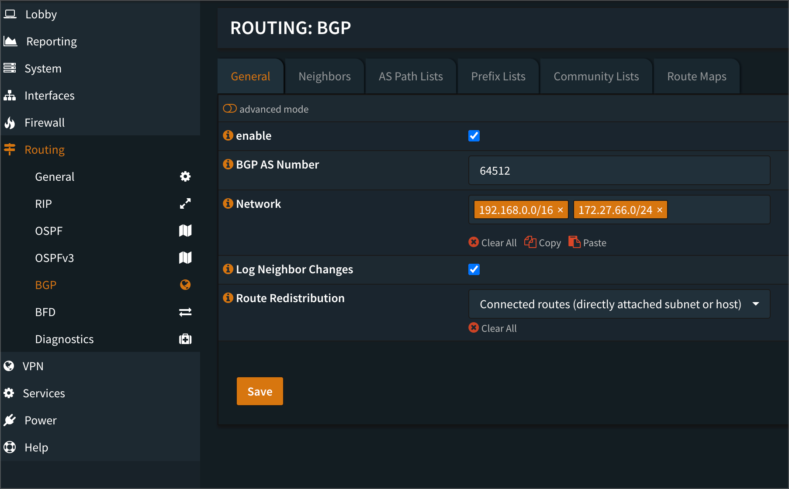
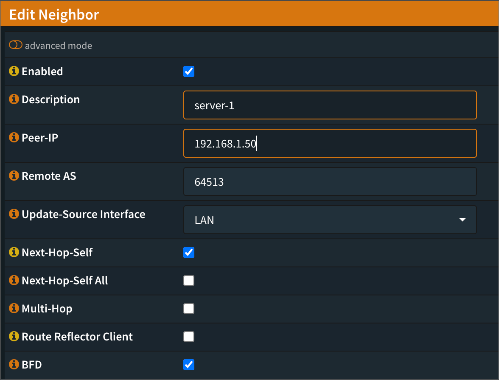

---
tags:
  - homelab
  - tech
  - metallb
  - opnsense
title: MetalLB & BGP in OpnSense
---

# MetalLB & BGP in OpnSense

!!!tip "Reference"
    - https://metallb.universe.tf/configuration/_advanced_bgp_configuration/
    - https://tyzbit.blog/configuring-bgp-with-calico-on-k8s-and-opnsense

While metalLB is able to provision IP addresses of any IP range, the client IP will still need to be able know how to connect to the cluster LoadBalancer IP.

Unless the client is in the same subnet or the router has a way to route the traffic to the subnet that metalLB is broadcasting, client device will not be able tor each the IP being broadcasted.

This documentation focuses on the latter - Configuring router to have a route back to the IP address MetalLB is broadcasting

## Configuring MetalLB
Create the following yaml for metallb

```yaml
apiVersion: metallb.io/v1beta2
kind: BGPPeer
metadata:
  name: homelab
  namespace: metallb-system
spec:
  myASN: 64513
  peerASN: 64512
  peerAddress: 192.168.1.1
---
apiVersion: metallb.io/v1beta1
kind: IPAddressPool
metadata:
  name: homelab
  namespace: metallb-system
spec:
  addresses:
  - 192.168.53.2-192.168.53.250
---
apiVersion: metallb.io/v1beta1
kind: BGPAdvertisement
metadata:
  name: homelab
  namespace: metallb-system
spec:
  ipAddressPools:
  - homelab

```

```yaml
apiVersion: metallb.io/v1beta1
kind: IPAddressPool
metadata:
    name: homelab
    namespace: metallb-system
spec:
    addresses:
    - 192.168.53.2-192.168.53.250
```

```yaml
apiVersion: metallb.io/v1beta1
kind: BGPAdvertisement
metadata:
    name: homelab
    namespace: metallb-system
spec:
    ipAddressPools:
    - homelab
```

**Notes:** 
The ASN number under BGPPeer stanza follows the below numbering:

- `myASN`: Kubernetes cluster ASN
- `PeerASN`: OpnSense ASN

The ASN numbers above will be used later in OpnSense configuration. ASN can be any number above `64512` as any number below are used in public systems on the Internet.

**If using OpnSense firewall rules:**
IP address ranges need to be specified under IPAddressPool stanza to determine the IP addresses to be assigned out when using metalLB. IP Subnet mask `e.g 192.168.53.0/24` cannot be used as `192.168.53.1` will be used as OpnSense gateway. 

**If not using OpnSense firewall rules:**
IP address subnet mask can be used in this case as `192.168.53.1` will be an available IP.

## Configuring OpnSense
1. Install `os-frr` in OpnSense by navigating to `System > Firmware > Plugins`
2. Once `os-frr` is installed, refresh the page and navigate to `Routing > BGP`
    
    - BGP AS Number refers to `peerASN` number in BGPPeer configuration above,
    - Network can be any network subnet that OpnSense is allowed to route to.
3. Click on Neighor at the top and click "+" to create a new neighbor
4. Enter details as below:
   


    !!!info
        - Description - Any name that is used to identify cluster nodes
        - Peer IP - IP address of cluster node
        - Remote AS - AS number of `myASN` in BGPPeer configuration above
        - Next-Hop-Self: Enabled
        - BFD: Enabled
        - Rest of the fields can be left as blank

5. Create a new neighbor for each node (control and worker node) in the cluster.
6. Navigate back to General tab and click Enable > Save
7. Navigate back to `Routing > General` and click Enable > Save
8. Navigate to `Routing > Diagnostics > BGP` to check if peers are being populated now.

## Creating Service LoadBalancer
As a test, JellySeer is used to assign a new IP address by MetalLB.
```yaml
apiVersion: v1
kind: Service
metadata:
  name: jellyseer
  annotations:
    metallb.universe.tf/address-pool: homelab
spec:
  selector:
    app: jellyseer
  ports:
  - port: 5055
    targetPort: 5055
  type: LoadBalancer
```

MetalLB should start assigning a IP address from the IPAddressPool named Homelab.